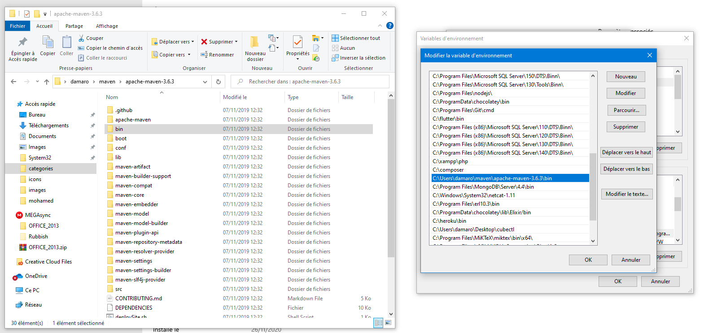

# Organiser et packager une application java avec Apache Maven
Grâce à Maven, vous allez pouvoir gérer les dépendances de votre projet et automatiser sa construction (compilation, test, production de livrable...)

## Résumé de la formation
Nous allons apprendre à:
* Demarrer un apache maven
* Organiser un projet maven
* Personnaliser les differente étape de sa construction
* livrer les livrable avec un site descriptif et différent rapport de celui-ci.
  
## Les objectifs de ce cours 
* Apprendre le fonctionnement et les principes généraux de Maven
* Intégrer l'utilisation de Maven dans votre IDE (Eclipse et IntelliJ)
* Initialiser un projet Maven
* Organiser un projet Maven multi-modules
* Personnaliser la construction (build) du projet avec des plugins
* Générer un site documentaire du projet et des rapports sur la construction (résultat des tests, qualité du code...)
## Les références sur Apache Maven
* le site officiel: [https://maven.apache.org](https://maven.apache.org)
* un livre en français, sous licence [Creative-commons CC BY-SA 4.0](https://creativecommons.org/licenses/by-nc-sa/4.0/deed.fr), écrit par Nicolas de Loof et Arnaud Héritier : [Apache Maven - Version 2 et 3](https://github.com/ndeloof/apache-maven-book).
* Apache Maven™ est une marque déposée par l'[Apache Software Foundation](https://www.apache.org/).

## Prérequis 
Pour installer Apache Maven, il nous faut avoir mis en place java dans notre pc, vous pouvez télécharger JDK sur lien suivant [https://www.oracle.com/java/technologies/javase-downloads.html](https://www.oracle.com/java/technologies/javase-downloads.html) et pour plus de détail sur la configuration de java [https://github.com/camara94/overview_java_dev#variables-denvironnement-java](https://github.com/camara94/overview_java_dev#variables-denvironnement-java)

## Installez Apache Maven
### Téléchargement
éléchargez Apache Maven depuis le site officiel (les checksums sont aussi fournis sur la page de téléchargement) : [https://maven.apache.org/download.cgi](https://maven.apache.org/download.cgi)

Téléchargement selon votre Système:
* Binary **tar.gz** archive si vous êtes sous Linux ou Mac OS
* Binary **zip** archive si vous êtes sous Windows

### Définir les variables d'environnement
Ensuite, il faut définir le chemin vers le JDK grâce à la **variable d'environnement** <code>JAVA_HOME</code> et ajouter les binaires du JDK et de Maven au PATH :
* sous Linux : ajoutez ces lignes, en les adaptant, à la fin de votre fichier <code>~/.bashrc</code> (ou <code>~/.zshrc</code> si vous utilisez Zsh) :
  <pre>
    <code>export JAVA_HOME="/chemin/vers/repertoire/env/java/jdk1.8.0_131"
MAVEN_HOME="/chemin/vers/repertoire/env/maven/apache-maven-3.5.0"
PATH="$PATH:$JAVA_HOME/bin:$MAVEN_HOME/bin"</code>
  </pre> 
  Si votre fichier contient déjà une ligne du type <code>PATH=...</code>, conservez-la et ajoutez aussi la ligne ci-dessus dans le fichier.
* **sous Mac OS** Même principe que pour linux
* **sous Windows :** Ouvrez les propriétés système (avec la commande <code>Win</code> + <code>Pause</code>),  dans l'onglet « Avancé », cliquez sur le bouton « Variables d'environnement » 
   1. Modifiez la propriété nommée <code>Path</code> en ajoutant ceci (à adapter):
  