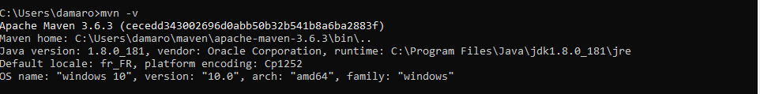
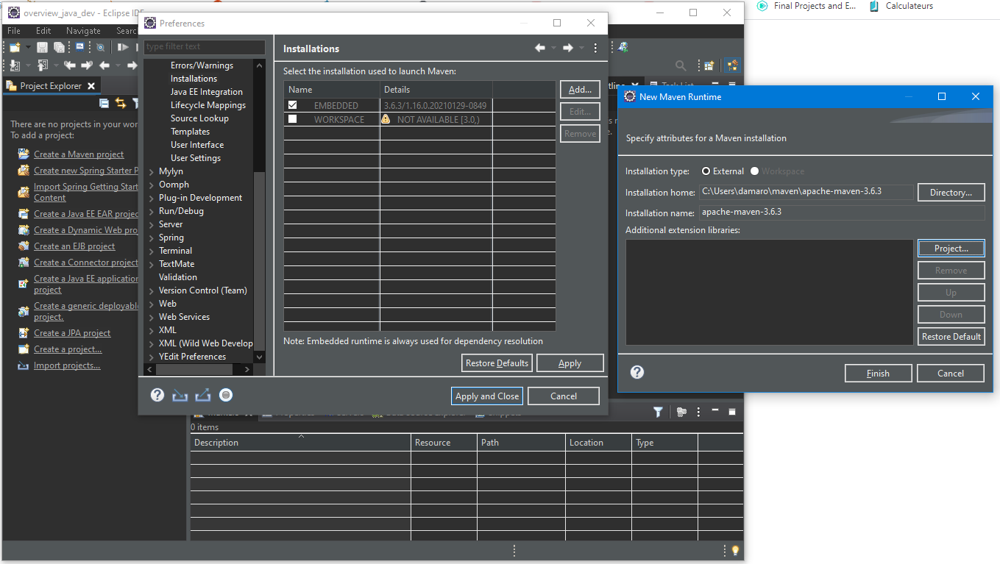
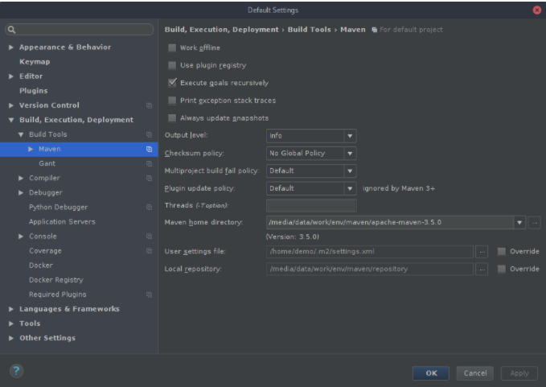
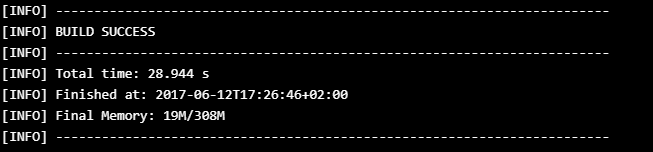

# Organiser et packager une application java avec Apache Maven
Grâce à Maven, vous allez pouvoir gérer les dépendances de votre projet et automatiser sa construction (compilation, test, production de livrable...)

## Résumé de la formation
Nous allons apprendre à:
* Demarrer un apache maven
* Organiser un projet maven
* Personnaliser les differente étape de sa construction
* livrer les livrable avec un site descriptif et différent rapport de celui-ci.
  
## Les objectifs de ce cours 
* Apprendre le fonctionnement et les principes généraux de Maven
* Intégrer l'utilisation de Maven dans votre IDE (Eclipse et IntelliJ)
* Initialiser un projet Maven
* Organiser un projet Maven multi-modules
* Personnaliser la construction (build) du projet avec des plugins
* Générer un site documentaire du projet et des rapports sur la construction (résultat des tests, qualité du code...)
## Les références sur Apache Maven
* le site officiel: [https://maven.apache.org](https://maven.apache.org)
* un livre en français, sous licence [Creative-commons CC BY-SA 4.0](https://creativecommons.org/licenses/by-nc-sa/4.0/deed.fr), écrit par Nicolas de Loof et Arnaud Héritier : [Apache Maven - Version 2 et 3](https://github.com/ndeloof/apache-maven-book).
* Apache Maven™ est une marque déposée par l'[Apache Software Foundation](https://www.apache.org/).

## Prérequis 
Pour installer Apache Maven, il nous faut avoir mis en place java dans notre pc, vous pouvez télécharger JDK sur lien suivant [https://www.oracle.com/java/technologies/javase-downloads.html](https://www.oracle.com/java/technologies/javase-downloads.html) et pour plus de détail sur la configuration de java [https://github.com/camara94/overview_java_dev#variables-denvironnement-java](https://github.com/camara94/overview_java_dev#variables-denvironnement-java)

## Installez Apache Maven
### Téléchargement
éléchargez Apache Maven depuis le site officiel (les checksums sont aussi fournis sur la page de téléchargement) : [https://maven.apache.org/download.cgi](https://maven.apache.org/download.cgi)

Téléchargement selon votre Système:
* Binary **tar.gz** archive si vous êtes sous Linux ou Mac OS
* Binary **zip** archive si vous êtes sous Windows

### Définir les variables d'environnement
Ensuite, il faut définir le chemin vers le JDK grâce à la **variable d'environnement** <code>JAVA_HOME</code> et ajouter les binaires du JDK et de Maven au PATH :
* sous Linux : ajoutez ces lignes, en les adaptant, à la fin de votre fichier <code>~/.bashrc</code> (ou <code>~/.zshrc</code> si vous utilisez Zsh) :
  <pre>
    <code>export JAVA_HOME="/chemin/vers/repertoire/env/java/jdk1.8.0_131"
MAVEN_HOME="/chemin/vers/repertoire/env/maven/apache-maven-3.5.0"
PATH="$PATH:$JAVA_HOME/bin:$MAVEN_HOME/bin"</code>
  </pre> 
  Si votre fichier contient déjà une ligne du type <code>PATH=...</code>, conservez-la et ajoutez aussi la ligne ci-dessus dans le fichier.
* **sous Mac OS** Même principe que pour linux
* **sous Windows :** Ouvrez les propriétés système (avec la commande <code>Win</code> + <code>Pause</code>),  dans l'onglet « Avancé », cliquez sur le bouton « Variables d'environnement » 
   1. Modifiez la propriété nommée <code>Path</code> en ajoutant ceci (à adapter):
  

### Tester l'installation
Testez maintenant l'installation de Maven :
1. * sous Linux / Mac OS : ouvrez un nouveau terminal
   * sous Windows : ouvrez une nouvelle console (<code>Win</code> + <code>R</code>, puis taper <code>cmd</code>, puis <code>Entrée</code>
2. Exécutons la commande suivante :
   <h3><code>mvn -v</code></h3>
3. Vous devriez obtenir un résultat ressemblant à ceci, si tout c'était bien passé.
   
## Configurez Apache Maven
La configuration de Maven se fait dans le fichier .**<code>${home}/.m2/settings.xml</code>**, dans le répertoire home de l'utilisateur (**<code>~/.m2/settings.xml</code>** sous Linux). Ce fichier n'existe pas par défaut, copiez celui contenu dans le répertoire conf de l'installation de Maven.

Maven télécharge les dépendances dans un repository local pour les gérer. Par défaut, il est situé dans le répertoire **<code>${home}/.m2/repository</code>** dans le home de l'utilisateur (**<code>~/.m2/repository</code>** sous Linux). Ce répertoire peut vite prendre beaucoup de place et je vous conseille de le sortir de votre home pour le mettre dans le répertoire d'environnement de développement. Pour cela, il faut modifier le fichier **<code>settings.xml</code>** comme ceci :
<pre>
<code>
&lt;settings xmlns="http://maven.apache.org/SETTINGS/1.0.0"
          xmlns:xsi="http://www.w3.org/2001/XMLSchema-instance"
          xsi:schemaLocation="http://maven.apache.org/SETTINGS/1.0.0 http://maven.apache.org/xsd/settings-1.0.0.xsd"&gt;
    ...
    &lt;!-- localRepository
    | The path to the local repository maven will use to store artifacts.
    |
    | Default: ${user.home}/.m2/repository --&gt;
    &lt;localRepository&gt;/chemin/vers/repertoire/env/maven/repository&lt;/localRepository&gt;
    ...
&lt;/settings&gt;
</code>
</pre>
Vous trouverez plus de détails sur la configuration de Maven dans la documentation officielle :
* Configuration : [https://maven.apache.org/configure.html]( https://maven.apache.org/configure.html)

* Fichier **<code>settings.xml</code>** : [https://maven.apache.org/settings.html](https://maven.apache.org/settings.html)

## Utilisez Apache Maven avec votre IDE
### Eclipse
#### Installation
Si vous avez téléchargé le package Eclipse IDE for Java EE Developpers ou Eclipse IDE for Java Developpers, le plugin de support de Maven est déjà embarqué.

Sinon, vous pouvez installer le plugin [M2Eclipse](https://www.eclipse.org/m2e/). 
Ouvrez les préférences (Window > Preferences) :
* Maven 
    * Installation
        1. Ajoutez une nouvelle installation externe :
           
        2. Cochez la nouvelle installation que vous venez de créer pour qu'elle devienne celle par défaut.
    * User Settings :
        * User Settings : **<code>/chemin/vers/home/utilisateur/.m2/settings.xml</code>**
### IntelliJ
Le support de Maven est embarqué par défaut dans JetBrains IntelliJ.
#### Configuration
Ouvrez les préférences par défaut (File > Other Settings > Default Settings...) :
* Build, Execution Deployment > Build Tools > Maven :
  
  * Maven home directory **<code> /chemin/vers/repertoire/env/maven/apache-maven-3.6.3</code>**
  * User settings file : **<code>/chemin/vers/home/utilisateur/.m2/settings.xml</code>** (si le chemin par défaut est incorrect, cochez la case Override et saisissez le bon chemin)
## Créez votre premier projet Maven
**Maven** utilise une approche dite **« convention over configuration »** (ou **convention plutôt que configuration** en français). Cela signifie que **Maven** a établi un certain nombre de conventions et que si vous les respectez, beaucoup de choses seront automatiques. Vous n'aurez donc que très peu de configuration à faire !

Une des premières conventions concerne l'arborescence d'un projet Maven. Celle-ci étant fixée (cf. [documentation](https://maven.apache.org/guides/introduction/introduction-to-the-standard-directory-layout.html)), Maven vous permet de générer un squelette de votre projet. C'est ce que je vais vous montrer tout de suite.

## Générer un squelette de projet Maven
Afin de générer le squelette d'un projet, Maven s'appuie sur des **archétypes** (ce sont des sortes de modèles). Ici, nous allons tout simplement demander à **Maven** de nous générer un squelette à partir de l'**archétype quickstart** 
Voici comment générer le squelette en mode console :
1. Ouvrez un terminal (ou une console) et placez-vous dans le répertoire où vous voulez créer le projet (Maven y créera un sous-répertoire pour votre nouveau projet).
    <h3> <code>cd maitriser-maven</code> </h3>
2. Générer un archétype :
   <h3><code>mvn archetype:generate -DarchetypeArtifactId=maven-archetype-quickstart -DarchetypeVersion=1.1</code></h3>
3. Maven va vous poser des questions afin de personnaliser la génération de votre projet :
   * groupId: <code>com.stardevcgroup</code>
   * artefactId: <code>mawatta</code>
   * version (1.0-SNAPSHOT): laissez vide
4. Ensuite Maven vous demande de confirmer les paramètres, il vous suffit donc presser la touche <code>Entrée</code>
5. Maven crée le squelette du projet : vous devriez voir un résultat comme celui-ci :
  